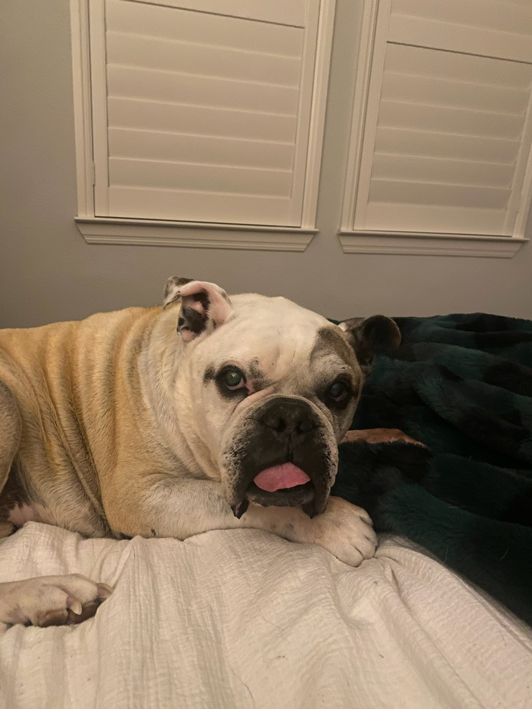

# Sampson's Travel Log



**Sampson’s Travel Log** is a heartfelt React-based tribute app chronicling the cross-country journey of a rescued senior bulldog named Sampson. From a shelter in Austin, Texas to his final days in Kenai, Alaska, this app captures each pawstep with photos, narrative, and love.

---

## 🚐 About the Project

Sampson was adopted in November 2023 and went on an unforgettable road trip from Galveston Bay, Texas to Alaska. This app documents that trip through:

- A card-based travel journal layout  
- Personal narratives written from Sampson’s point of view  
- Chronological photo entries  
- Like buttons for each post  
- A tribute audio feature (*“Lean on Me”*) on his final post

---

## ✨ Features

- **React Component Structure**
  - `App.jsx`: Loops through all travel entries
  - `Entry.jsx`: Displays each memory card
- **Responsive Design** for mobile & desktop
- **Audio Playback** for Sampson’s final story
- **Image Assets** stored in `/src/assets/images/sampson/`
- **Data Source** in `travelData.js`

---

## 📁 Folder Structure

```
├── public/
│   └── assets/audio/lean-on-me.mp3
├── src/
│   ├── assets/images/sampson/
│   ├── components/
│   │   ├── Entry.jsx
│   │   └── Header.jsx
│   ├── App.jsx
│   └── travelData.js
└── README.md
```

---

## 🐾 Getting Started

```bash
npm install
npm run dev
```

Visit `http://localhost:5173/` (or your Vite dev server URL).

---

## 🚀 Deployment

Deployed via [Netlify](https://www.netlify.com/) with GitHub integration. Push to `main` to trigger redeploy.

---

## 🎵 Audio Licensing

The app includes a farewell tribute using *“Lean on Me.”*  
Make sure you use a royalty-free version or obtain permission if publishing publicly.

---

## ❤️ Special Thanks

To **Sampson** — for reminding us to slow down, stay grounded, and enjoy the ride.  
This journal was made in your honor.

---

**Unleash Adventure.**  
*— Sampson* 🐶

---

## 📝 License

This project is licensed under the [MIT License](https://opensource.org/licenses/MIT).

```
MIT License

Copyright (c) 2025 Emmett

Permission is hereby granted, free of charge, to any person obtaining a copy
of this software and associated documentation files (the “Software”), to deal
in the Software without restriction, including without limitation the rights  
to use, copy, modify, merge, publish, distribute, sublicense, and/or sell  
copies of the Software, and to permit persons to whom the Software is  
furnished to do so, subject to the following conditions:

The above copyright notice and this permission notice shall be included in  
all copies or substantial portions of the Software.

THE SOFTWARE IS PROVIDED “AS IS”, WITHOUT WARRANTY OF ANY KIND, EXPRESS OR  
IMPLIED, INCLUDING BUT NOT LIMITED TO THE WARRANTIES OF MERCHANTABILITY,  
FITNESS FOR A PARTICULAR PURPOSE AND NONINFRINGEMENT. IN NO EVENT SHALL THE  
AUTHORS OR COPYRIGHT HOLDERS BE LIABLE FOR ANY CLAIM, DAMAGES OR OTHER  
LIABILITY, WHETHER IN AN ACTION OF CONTRACT, TORT OR OTHERWISE, ARISING FROM,  
OUT OF OR IN CONNECTION WITH THE SOFTWARE OR THE USE OR OTHER DEALINGS IN  
THE SOFTWARE.
```